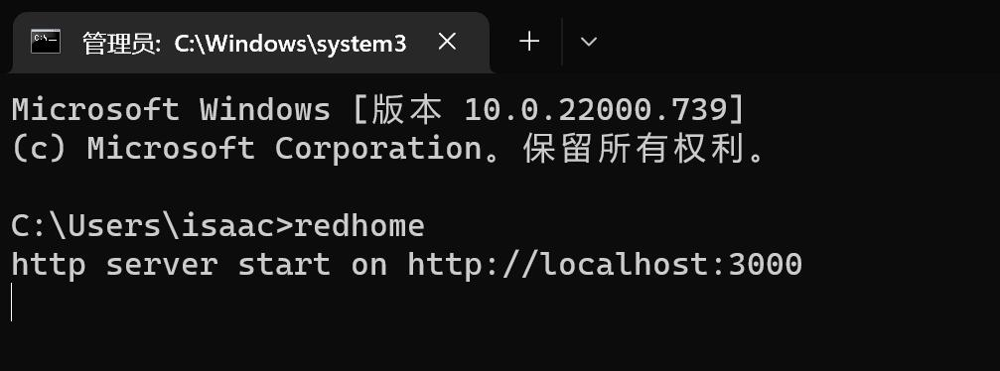

# redhome
> 红房子导航是一个资源聚合门户工具，它可以聚合部门内部各类系统、工具、文档等等，方便开发人员在统一的入口访问各类资源，不必在浏览器中添加各种收藏，不再迷路求人，一个站点链到一切，该工具自带五毛特效，可随机切换壁纸。


[demo](https://app.isaacxu.com/webapi/)


## 功能
* 网址地址配置
* 自适应终端，pc端和移动端均可访问
* 切换壁纸，切换最近12天内必应壁纸

## 快速开始
```bash
# 安装
npm i -g redhome
# 启动
redhome
```




